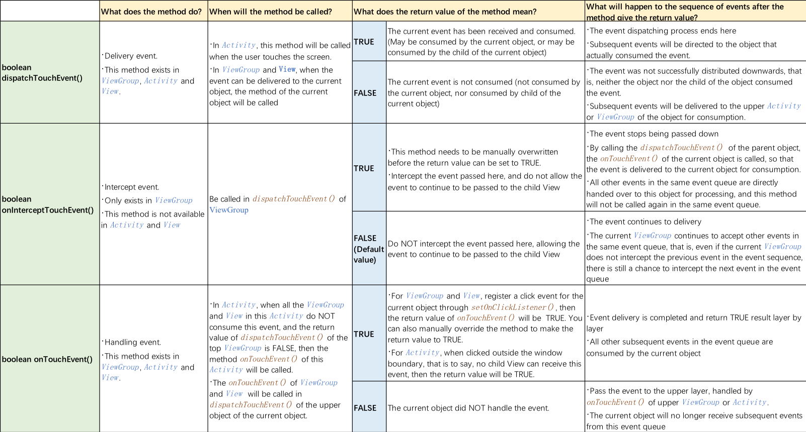

# Android Base

## Android 源码
https://cs.android.com/

## launch mode

| 用例                                  | 启动模式       | 多个实例？                                                   | 注释                                                         |
| :------------------------------------ | :------------- | :----------------------------------------------------------- | :----------------------------------------------------------- |
| 大多数 Activity 的正常启动            | “`standard`”   | 是                                                           | 默认。系统始终会在目标任务中创建新的 Activity 实例，并向其传送 Intent。 |
| “`singleTop`”                         | 视情况而定     | 如果目标任务的顶部已存在 Activity 实例，则系统会通过调用该实例的 `onNewIntent()` 方法向其传送 Intent，而非创建新的 Activity 实例。 |                                                              |
| 专用启动 *（不建议在一般情况下使用）* | “`singleTask`” | 否                                                           | 系统会在新任务的根位置创建 Activity 并向其传送 Intent。不过，如果已存在 Activity 实例，则系统会调用该实例的 `onNewIntent()` 方法（而非创建新的 Activity 实例），向其传送 Intent。 |
| “`singleInstance`”                    | 否             | 与“`singleTask"`”相同，只是系统不会将任何其他 Activity 启动到包含实例的任务中。该 Activity 始终是其任务中的唯一 Activity。 |                                                              |

- standard

系统默认的启动模式，每次都会创建新的对象实例。

Intent增加FLAG_ACTIVITY_CLEAR_TOP标记，启动目标Activity，也会创建新的实例

- singleTop

若启动的Activity不存在，则创建新的实例

若要启动的Activity在栈顶，则会复用当前实例，并调用onNewIntent来处理新传入的Intent，也就是说栈顶复用目标Activity的实例

若启动的Activity存在，但不在栈顶，则会创建新的实例

如果给Intent增加FLAG_ACTIVITY_CLEAR_TOP标记，则即便启动的Activity不在栈顶，也会调用onNewIntent，不创建新的实例，相当于先把目标Activity之上的Activity清空，目标Activity就处于栈顶位置，所以会调用onNewIntent

- singleTask

目标Activity不在当前栈中，则创建新的实例

目标Activity在当前栈中，则会清空目标Activity之上的Activity实例，使目标Activity实例处于栈顶，此时会调用onNewIntent。也就是说栈内复用已存在的目标Activity实例

- singleInstance

创建新的任务栈，并将目标Activity置于新任务栈的根部，并且此任务栈只有一个目标Activity的实例，不会有其他Activity的实例。如果目标Activity已经存在，会调用onNewIntent，而不是创建新的实例

## Service

> `Service` 是一种可在后台执行长时间运行操作而不提供界面的应用组件。服务可由其他应用组件启动，而且即使用户切换到其他应用，服务仍将在后台继续运行。此外，组件可通过绑定到服务与之进行交互，甚至是执行进程间通信 (IPC)。例如，服务可在后台处理网络事务、播放音乐，执行文件 I/O 或与内容提供程序进行交互。

[服务概览](https://developer.android.com/guide/components/services?hl=zh-cn)

简单来说服务是一个不需要用户交互即可在后台运行的组件，默认情况下，服务会在程序的主线程运行，于是如果需要长时间的执行任务，还是需要创建线程来完成工作。

服务的生命周期，根据服务启动的方式而有所不同。启动服务或者绑定服务，即使用startService或是bindService来运行服务。

通过startService方式运行服务，其生命周期函数有：onCreate、onStartCommand、onDestory

通过bindService方式运行服务，其生命周期函数有：onCreate、onBind、onUnbind、onDestory

## 

## View的绘制流程

https://www.cnblogs.com/andy-songwei/p/10955062.html

RecycleView卡顿优化

https://my.oschina.net/u/4351661/blog/4387396

滑动冲突

https://www.jianshu.com/p/982a83271327

## Native和JS的交互

https://zhuanlan.zhihu.com/p/94574985

SenchaTouch和JS的交互

1. Android4.2之前，使用的是prompt方式，cordova-android.js 中使用这种方式和Native交互

   js端，调用prompt

   native端，SystemWebChromeClient在onJsPrompt方法中拦截，并调用CordovaBridge的promptOnJsPrompt，最后调用jsExec，在调用pluginManager.exec，再调用plugin.execute，执行到自定义类重写的execute方法

2. 如果是4.2以后版本，使用WebView的addJavascriptInterface注入Native方法，直接调用SystemExposedJsApi的exec，调用到CordovaBridge的jsExec，后续步骤和1一样

3. Native回调JS端

   - webView.loadUrl(“javascript：callJS()”)

   - WebView的evaluateJavascript方法，Android4.4以后可用

Weex js和Native的交互

Native端写的Module，在初始化的时候，通过WXModuleManager将自己写的一些modules注册到一个Map中，JS端调用Native方法时，通过注册名字，使用反射的机制，从注册的Map中获取对应的类，并调用对应的方法，实现js和Native的通信。

https://segmentfault.com/a/1190000013388649 这篇文章详细的介绍了weex框架的执行原理

## AMS

https://wiki.jikexueyuan.com/project/deep-android-v2/activity.html

## Android动画

https://juejin.cn/post/6844903465211133959

## 换肤

https://juejin.cn/post/6844903647868878861

[Android-skin-support](https://github.com/ximsfei/Android-skin-support)

## 事件

https://medium.com/@li.shuang.0425/5-steps-for-beginners-to-understand-event-dispatching-in-android-9b3b85024188

## mipmap vs drawable

https://developer.aliyun.com/article/7416
