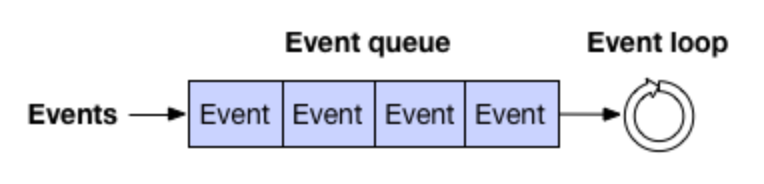
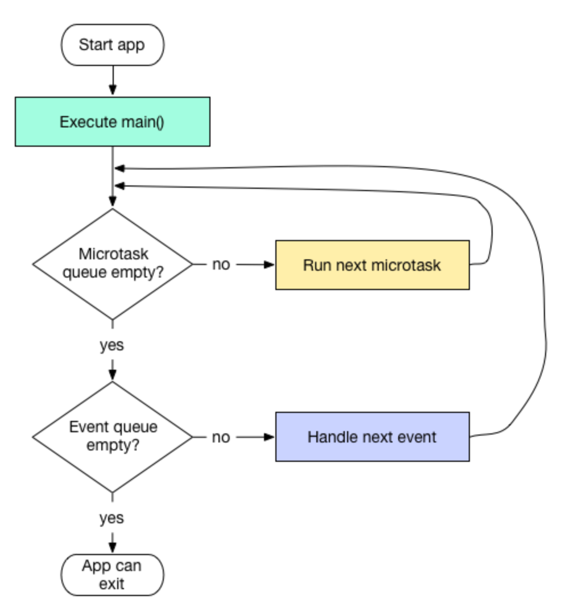

# 初步了解Flutter isolate

## isolate

> An isolated Dart execution context.
>
> All Dart code runs in an isolate, and code can access classes and values only from the same isolate. Different isolates can communicate by sending values through ports (see [ReceivePort](https://api.flutter.dev/flutter/dart-isolate/ReceivePort-class.html), [SendPort](https://api.flutter.dev/flutter/dart-isolate/SendPort-class.html)).

什么是isolate？正如官方所定义，isolate是独立的Dart执行上下文。所有的Dart代码都是在isolate中运行，同一个isolate中的类可以直接访问，不同的isolate，只能通过port发送数据来进行通信。

简单的理解一下，isolate类似于Andriod中的线程，但是多个isolate之间不能共享内存。Flutter应用启动后，会有一个main isolate运行，类似于Android中的主线程，但如果有耗时的操作，Android可以开启一个工作线程，Flutter中则开启一个新的isolate去处理耗时任务。

isolate之间只能通过发送消息来进行通信，一个isolate收到其他isolate消息后，通过自身的Event Loop来对消息进行处理。

## Event loop

Event loop不断的从Event queue中获取事件并处理，比如I/O事件，点击事件，其他isolate发送的消息等。



对于Dart应用来说，除了**event queue**外，还有一个**microtask queue**，并且microtask queue中的任务会优先于event queue执行。



Dart中通过Future向event loop的队尾添加项目，而向microtask queue中添加项目，需要使用**scheduleMicrotask()**。

基本概念就先了解到这里，下面通过具体demo来看下Flutter中如何新建一个isolate来执行耗时操作。

## isolate demo

demo的基本任务如下：

1. 创建新的isolate
2. 通过main isolate向新建的isolate发送消息
3. 新的isolate接收到消息后处理，开始执行耗时任务
4. 新的isolate将耗时任务的结果和执行时消耗的时间，发送给main isolate
5. main isolate更新UI，显示结果和消耗的时间

### 创建isolate

```dart
Future<void> createIsolate() async {
   _receivePort = ReceivePort();
   _isolate = await Isolate.spawn(_entryPoint, _receivePort.sendPort);
}
```

通过spawn静态方法创建一个新的isolate，其中第一个参数为入口函数，第二个为入口函数的参数。_receivePort用于接收new isolate发送的消息，通过\_entryPoint将\_receivePort的SendPort传给new isolate，这样new isolate就可以使用此sendport给main isolate发送消息了。

### new isolate

\_entryPoint中的代码就是在new isolate中执行，看下代码：

```dart
_entryPoint(SendPort sendPort) {
  var receivePort = ReceivePort();
  //将自己的sendport发送给main isolate
  sendPort.send(receivePort.sendPort);

  //receive message from main isolate
  receivePort.listen((dynamic message) async {
    if (message is int) {
      var timer = Stopwatch();
      timer.start();
      var sum = await generateAndSum(message);
      timer.stop();
      sendPort.send({'sum': sum, 'time': timer.elapsedMilliseconds / 1000});
    }
  });
}
```

可见，在新的isolate中，首先创建了一个ReceivePort，然后通过main isolate的sendPort将自身的sendport发送给main isolate，这样新的isolate和main isolate就建立了联系，互相得到对方receiveport的sendport，这样互相给对方发送消息。

new isolate通过receivePort监听，获取到消息后，执行耗时任务generateAndSum，并记录耗时任务的执行时间，最后将结果通过main isolate的sendport发送回去。

### 耗时任务

模拟的耗时任务是循环计算随机数的和

```dart
Future<int> generateAndSum(int num) async {
  var random = Random();
  int sum = 0;
  for (var i = 0; i < num; i++) {
    for (var j = 0; j < 1000000; j++) {
      sum += random.nextInt(100);
    }
  }

  return sum;
}
```

双重循环，外循环次数由main isolate传递的消息num控制，内循环是一个100万次随机数的求和计算，总的来说就是由num个100万次随机数求和。

### main isolate接收new isolate的消息

```dart
_receivePort.listen((message) {
      if (message is SendPort) {
        _sendPort = message;
      } else if (message is Map) {
        print('message is map: $message');
        sum = message['sum'];
        timesConsume = message['time'];
        isInProgress = false;
        notifyListeners();
      }
    });
```

如果消息的类型为SendPort，则获得new isolate发送过来的sendport，进而用此sendport向new isolate发送消息；

如果消息的类型为Map，则说明收到了new isolate执行耗时任务的结果，解析结果，然后更新UI，这里使用Provider的notifyListeners更新Widget Tree。

## 总结

两个isolate之间通过SendPort和ReceivePort的配合使用来进行信息的传递和接收，刚开始对这块理解有点晕乎，自己实现了这个demo之后，对SendPort和ReceivePort的使用有了一个比较清晰的认识。ReceivePort在各自的isolate中创建，然后通过将各自receiveport的sendport对象发送给对方，这样通过收到的sendport对象就可以向对方isolate的发送消息，各自的receiveport接收消息并处理。

最后附上此isolate demo完整代码：https://github.com/zacdaryl/flutter-playground/blob/master/lib/isolate/isolate_page.dart


