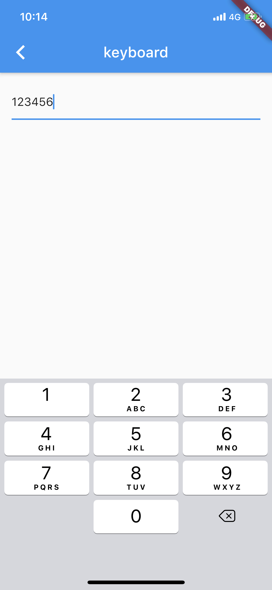
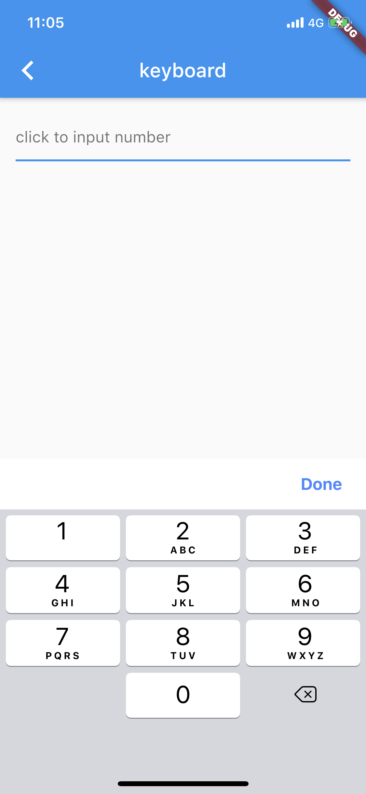

# Keyboard

## 给数字键盘增加完成按钮

### 背景


> 如图，在使用TextField弹出数字键盘时，发现iOS端键盘没有完成按钮，这样在内容输入完成后，无法将键盘隐藏，十分不便。



## 搜索

问题出现了，当然要解决，作为一个“懒”人，第一步当然是问下Google了。万能Google的第一条搜索结果便指向了Github上Flutter仓库对应的 [issues](https://github.com/flutter/flutter/issues/12220), 通过翻看相关的评论，发现已经有人发布了对应插件来解决这个问题，插件名字为[Keyboard Actions](https://pub.dev/packages/keyboard_actions)，这里看下这个插件的介绍：

> Add features to the Android / iOS keyboard in a simple way.
>
> Because the keyboard that Android / iOS offers us specifically when we are in numeric mode, does not bring the button to hide the keyboard. This causes a lot of inconvenience for users, so this package allows adding functionality to the existing keyboard.

琢磨了一会这个插件，感觉可以很容易的解决目前遇到的问题，但是不适用插件的情况下，自己处理键盘弹出事件，在键盘上方增加自定义view是否可以达到效果呢？

继续Google，答案是肯定的。找到了这篇文章[Keyboard Done Button UX in Flutter iOS App](https://blog.usejournal.com/keyboard-done-button-ux-in-flutter-ios-app-3b29ad46bacc)，通读了一遍之后，感觉可行，于是就根据文章敲了一遍代码，实际结果确实ok，效果如下图：



## 解决方案

根据上述文章，基本的思路如下：

1. 监听键盘弹出事件
2. 键盘弹出时，在键盘上方放置Done按钮

下面通过代码看下具体是如何实现的。

### 监听键盘事件

使用FocusNode，在输入框获取到焦点后，认为键盘已经弹出，此时显示自定义的Done按钮即可。什么是FocusNode？简单来说就是一个可以获取键盘焦点并且处理键盘事件的类。

> # FocusNode class
>
> An object that can be used by a stateful widget to obtain the keyboard focus and to handle keyboard events.

需要深入了解FocusNode，可以认真读一下官方文档，这里就不拓展太多了，通过代码看下如何使用FocusNode，主要是在initState中注册监听即可。

```dart
 FocusNode numberFocusNode = new FocusNode();
……

 @override
  void initState() {
    super.initState();

    numberFocusNode.addListener(() {
      if (numberFocusNode.hasFocus) {
        showOverlay(context);
      } else {
        removeOverlay();
      }
    });
  }

……
  
  child: TextField(
		keyboardType: TextInputType.number,
		decoration: InputDecoration(hintText: 'click to input number'),
    focusNode: numberFocusNode,
    keyboardAppearance: Brightness.light,
	),
```

另外，pub.dev上有一个插件[keyboard_visibility](https://pub.dev/packages/keyboard_visibility)可以监听键盘弹出事件.

### 键盘上方设置Done按钮

这里使用OverlayEntry将按钮放在键盘上方，看下上文的showOverlay和removeOverlay方法：

```dart
showOverlay(BuildContext context) {
    if (overlayEntry != null) return;
    OverlayState overlayState = Overlay.of(context);
    overlayEntry = OverlayEntry(builder: (context) {
      return Positioned(
          bottom: MediaQuery.of(context).viewInsets.bottom,
          right: 0.0,
          left: 0.0,
          child: InputDoneView());
    });

    overlayState.insert(overlayEntry);
  }

  removeOverlay() {
    if (overlayEntry != null) {
      overlayEntry.remove();
      overlayEntry = null;
    }
  }
```

InputDoneView是一个包含Done按钮的Widget，将其作为OverlayEntry的child，通过OverlayState将OverlayEntry插入到Overlay中，

其中MediaQuery.of(context).viewInsets.bottom将位置固定在键盘的正上方。

> When a mobile device's keyboard is visible `viewInsets.bottom` corresponds to the top of the keyboard.

```dart
class InputDoneView extends StatelessWidget {
  @override
  Widget build(BuildContext context) {
    return Container(
      width: double.infinity,
      color: Colors.white,
      child: Align(
        alignment: Alignment.topRight,
        child: Padding(
          padding: const EdgeInsets.only(top: 4.0, bottom: 4.0),
          child: CupertinoButton(
            padding: EdgeInsets.only(right: 24.0, top: 8.0, bottom: 8.0),
            onPressed: () {
              FocusScope.of(context).requestFocus(new FocusNode());
            },
            child: Text("Done",
                style: TextStyle(
                    color: Colors.blueAccent, fontWeight: FontWeight.bold)),
          ),
        ),
      ),
    );
  }
}
```


至此，在iOS的数字键盘弹出时，在键盘上方设置完成按钮，实现思路基本分析完毕，具体代码可参考 [这里](https://github.com/zacdaryl/flutter-playground/blob/master/lib/keyboard/keyboard_done.dart)

